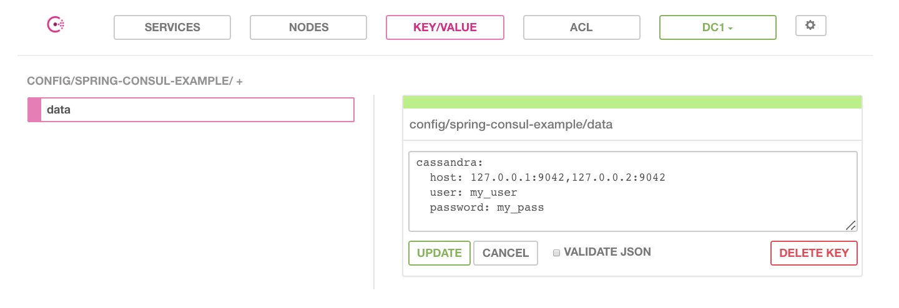

Spring Cloud Consul Client
===========================

### Registration with Consul
A Spring Boot service can register with a Consul Agent by making the following
changes to `bootstrap.yml`,

```yaml
spring:
  cloud:
    consul:
      host: localhost
      port: 8500
```

The above changes can be made in the `application.yml` if your service doesn't
use Spring Cloud configuration functionalities of Consul.

### Health Check
A Consul Agent check the health of a Spring Boot application by using the
`/health` endpoint. 

If the service uses a non-default context path, the changes to the health endpoint
needs to be configured in `application.yml` . For example if the context path
is changed to `foo`, the following changes need to be made:

```yaml
spring:
  cloud:
    consul:
      discovery:
        healthCheckPath: foo/health
        healthCheckInterval: 15s
```

The interval used by Consul to check the health endpoint can also be configured. 

The latest version of Consul (1.0.2) shows a registered Spring Boot application 
to be in critical condition. 


If you check the `/health` endpoint of your application, the consul health
will show up as down:

```json
{
    "consul": {
        "status": "DOWN",
        "services": {
            "consul": [
        
            ],
            "spring-consul-example": [
        
            ]
        },
        "error": "java.lang.IllegalArgumentException: Value must not be null"
    }
}
```

This problem can be mitigated by adding the following snippet in 
`bootstrap.yml`,

```yaml
management:
  security:
    enabled: false
  health:
    consul:
      enabled: false 
```

Once you make the above changes, the service shows up as passing.


### Configuration with Consul
A Spring Boot service can take advantage of Consul's KV store for storing its
configuration properties. The Configurations in Consul KV store are 
usually stored under `/config` folder (data folder and not filse system folder).

For example, the properties of an application named `spring-consul-example`
will be stored under folder,

`config/spring-consul-example/`

The properties of application named `spring-consul-example` and with 
`dev` profile will be stored under folder,

`config/spring-consul-example,dev/`

Proerties in `config/application` is applicable to all applications.

The following changes need to be made to the `bootstrap.yml` to enable 
Consul configuration,

```yaml
spring:
  cloud:
    consul:
      config:
        enabled: true
        prefix: config
        profileSeparator: '::'
```

- Setting `enabled` to `true` enables Consul Config
- `prefix` sets the base folder for configuration values which in this example 
is `config`
- `profileSeparator` sets the value of the separator used to separate the 
profile name in property sources with profiles


#### YAML Configuration
The configuration properties can be stored as a YAML blob with an appropriate 
data key in Consul KV store. For example the properties for the application 
`spring-consul-example` can be stored as JSON blob with `data` as the data key,

```
config/spring-consul-example/data
```

The YAML blob can look something as shown below,

```yaml
cassandra:
  host: 127.0.0.1:9042,127.0.0.2:9042
  user: my_user
  password: my_pass
```

If the data is stored as a YAML blob, following properties need to be set in
the `bootstrap.yml`,

1. `spring.cloud.consul.config.format` to `YAML`
1. `spring.cloud.consul.config.data-key` to `data`

```yaml
spring:
  cloud:
    consul:
      config:
        format: YAML
        data-key: data
```   

The properties can be inserted either manually from the Consul UI or via 
command line. 

#### Entry of Properties from Consul Web UI
To set configuration properties from Consul UI:
- Open the Consul UI page by opening the link, **http://localhost:8500/ui/**, 
in your favorite browser.
- Once the page is open, navigate to KV page by clicking the **KEY/VALUE**
button.
- In the KV page, create a new key by entering `config/spring-consul-example/data`
as the name of the key in text box below **Create Key**.
- Enter a YAML blob or plain string in the text area below and click the
**CREATE** button. This will enter a new set of properties



#### Entry of Properties from Commandline
Consul Agent also provides a command line too to create configuration properties.
- Open a terminal and naviagte to the the directory where the Consul Agent
is located.
- To create a new property named `foo` with a value `bar, you can execute 
the following command:
```
$ ./consul kv put foo bar
```
It will create the new property,
```
Success! Data written to: foo
```

- Once the property is created, you can also access the property from the
command line,
```
$ ./consul kv get foo
bar
``` 

The previously created property from the UI can also be accessed by the 
following command:

```
$ ./consul kv get config/spring-consul-example/data
cassandra:
  host: 127.0.0.1:9042,127.0.0.2:9042
  user: my_user
  password: my_pass
```

You can also load YAMl properties from command line. The YAML data can be read 
from a file by prefixing the file name with the @ symbol.

```
$  ./consul kv put config/application/data @data.yml
Success! Data written to: config/application/data
```

The data can be retrieved the same way, 

```
$ ./consul kv get config/application/data
cassandra:
  host: 127.0.0.1:9042,127.0.0.2:9042
  user: my_user
  password: my_pass
```

### Read Configuration Properties
The configuration is loaded by Spring service during the **bootstrap** phase.
The properties can be read from Consul KV store with the help of `@Value` 
annotation and the stored property name. Here is an example,

```java
@Configuration
@RefreshScope
public class ConsulConfiguration {

    @Value("${cassandra.host}")
    private String cassandraHost;

    @Value("${cassandra.user}")
    private String userName;

    @Value("${cassandra.password}")
    private String password;


    @PostConstruct
    public void postConstruct() {
        System.out.println(
                "********** cassandra.host: " + cassandraHost);
        System.out.println(
                "********** cassandra.user: " + userName);
        System.out.println(
                "********** cassandra.password: " + password);
    }
}
```

Changes to Spring Boot Application class,

```java
@SpringBootApplication
@EnableAutoConfiguration
@EnableConfigurationProperties
@EnableDiscoveryClient
@ComponentScan(basePackages = {"com.basaki"})
public class Application {

    public static void main(String[] args) {
        SpringApplication.run(Application.class, args);
    }
}
```

### Run
Bfore running the Spring Boot application, please make sure that the Consul 
Agent is up and running with the application configuration properties loaded.
The Spring Boot client application can be run from the command line by
the following command,

```
java -jar target/spring-security-consul-client-1.0.0.jar
```
